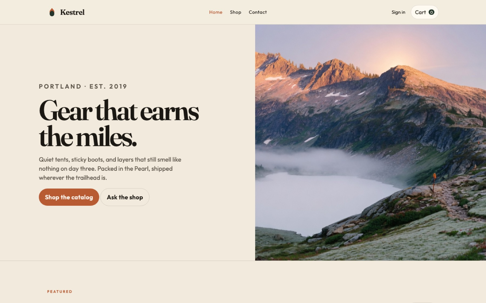
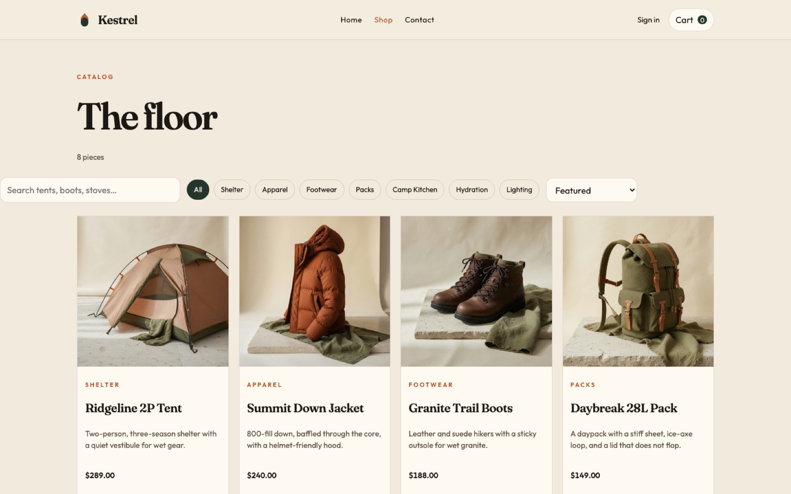
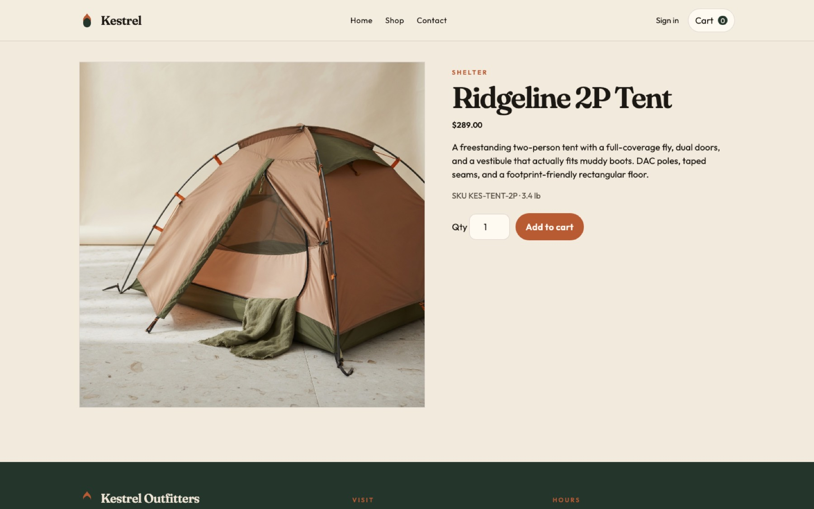
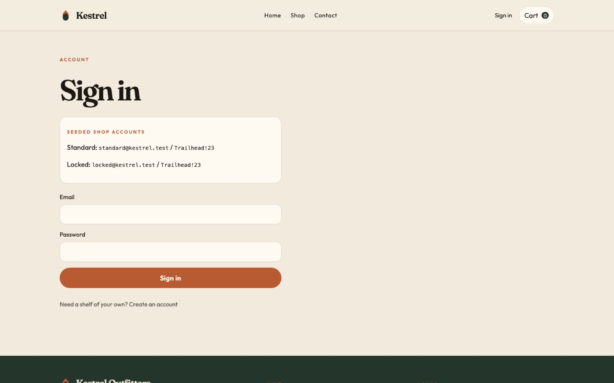

# Kestrel Automation

[](https://github.com/myap2/kestrel-automation/actions/workflows/ci.yml)

SDET portfolio: **Playwright**, **Cypress**, and **C# / Selenium 4** covering the same journeys against a local storefront I control.

The shop is a fixture, not a third-party website. That is the point. Catalog, accounts, and APIs are deterministic, tagged with `data-testid`, and safe to run in CI. A recruiter can clone this, start the app, and watch every suite pass.

<p align="center">
  
  
</p>
<p align="center">
  
  
</p>

## What this is meant to show

| Skill | Where to look |
|---|---|
| Page Object Model | [`playwright/pages`](playwright/pages), [`cypress/cypress/support/pages`](cypress/cypress/support/pages), [`selenium-csharp/.../Pages`](selenium-csharp/Kestrel.Automation/Pages) |
| Stable locators | `data-testid` on the storefront, `getByTestId` / CSS in the suites |
| Explicit waits (Selenium) | [`TestBase.cs`](selenium-csharp/Kestrel.Automation/Support/TestBase.cs) — zero implicit wait, no `Thread.Sleep` |
| Network mocking | [`playwright/tests/mocked-catalog.spec.ts`](playwright/tests/mocked-catalog.spec.ts), [`cypress/e2e/mocked-catalog.cy.ts`](cypress/cypress/e2e/mocked-catalog.cy.ts) |
| Negative paths | Bad password, locked account, empty catalog, product API 500 |
| API checks beside UI | Playwright `request`, C# `HttpClient` |
| CI | [`.github/workflows/ci.yml`](.github/workflows/ci.yml) — three jobs, one per framework |

Shared cases: [`shared/TEST-CASES.md`](shared/TEST-CASES.md).

## Why a local app

Testing Amazon or realtor.com looks busy and fails in a screen-share. CAPTCHAs, ToS, and weekly DOM churn do not belong in a portfolio.

Kestrel Outfitters is a small Portland gear shop with a real REST API (`/api/products`, `/api/auth`, `/api/cart`, `/api/checkout`, `/api/contact`). Playwright and Cypress stub `GET /api/products` so the UI can be proven against empty, error, and fixture data — including a **Ghost Quilt** that does not exist in the live catalog. Selenium drives the live local API, which is the idiomatic WebDriver split.

```mermaid
flowchart LR
  subgraph suites [Suites]
    PW[Playwright TS]
    CY[Cypress]
    SE[Selenium C#]
  end
  APP[Storefront :3000]
  API["JSON API"]
  PW --> APP
  CY --> APP
  SE --> APP
  APP --> API
  PW -. page.route .-> API
  CY -. cy.intercept .-> API
```

## Stacks

| Folder | Runtime | Style |
|---|---|---|
| [`app/`](app) | Node, no framework | Multi-page shop + in-memory API |
| [`playwright/`](playwright) | Playwright Test, TypeScript | Page Objects, `page.route()`, API tests, Playwright starts the server |
| [`cypress/`](cypress) | Cypress 13, TypeScript | Page Objects, `cy.intercept()`, custom `loginAsStandard` |
| [`selenium-csharp/`](selenium-csharp) | NUnit 4, Selenium 4, .NET 8 | Page Objects, `WebDriverWait`, Selenium Manager, Chrome |

## Run it

```bash
git clone https://github.com/myap2/kestrel-automation.git
cd kestrel-automation
npm run app                 # http://localhost:3000
```

Or `docker compose up --build`.

Seeded accounts (also printed on `/login.html`):

| Role | Email | Password |
|---|---|---|
| Standard | `standard@kestrel.test` | `Trailhead!23` |
| Locked | `locked@kestrel.test` | `Trailhead!23` |

```bash
# Playwright — installs its own browser, boots the app if needed
npm --prefix playwright ci
npx --prefix playwright playwright install chromium
npm run test:playwright

# Cypress — app must already be running
npm --prefix cypress ci
npm run test:cypress

# Selenium — .NET 8 SDK + Chrome, app must already be running
dotnet test selenium-csharp/Kestrel.Automation.sln
```

Headed Chrome: `HEADED=1 dotnet test selenium-csharp/Kestrel.Automation.sln`.

## Journeys every suite implements

1. Login — valid, invalid, locked
2. Catalog — search `tent`, filter Apparel
3. Cart → checkout → order id `KES-#####`
4. Contact form → reference `NOTE-###`
5. Playwright + Cypress only — mocked empty list, 500, Ghost Quilt

## Design notes

- **Same journeys, three tools.** The value is the pattern, not a unique script per framework.
- **Page objects stay thin.** Locators and user actions live on the page; assertions stay in the spec unless they are part of the flow (flash, navigation).
- **Prefer roles and test ids.** The storefront is instrumented so tests do not scrape CSS class soup.
- **Stub where the tool is good at stubbing.** Playwright `page.route` and Cypress `cy.intercept` replace network at the browser. Selenium does not pretend to.

MIT licensed. The storefront, photography, and suites are original work for this portfolio.
